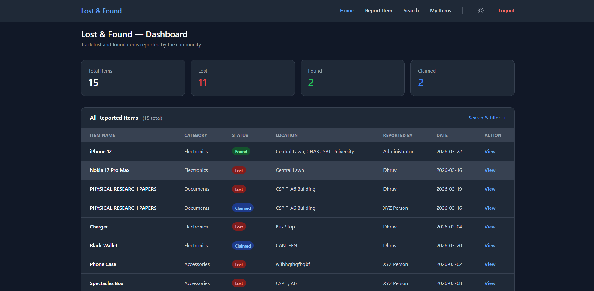
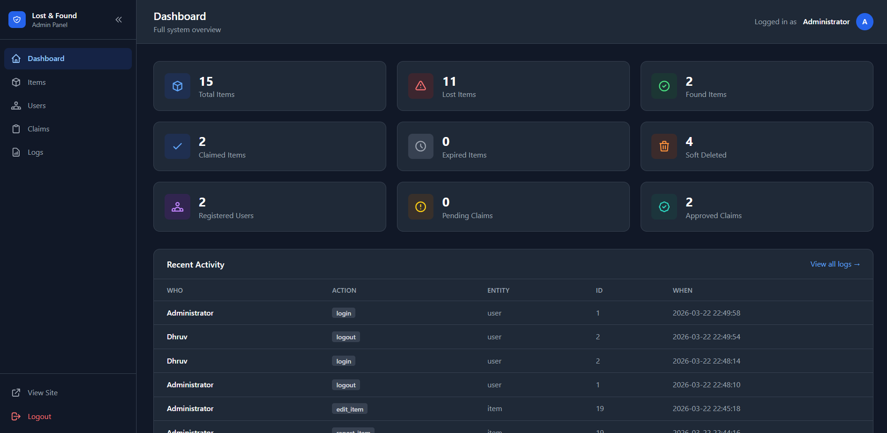
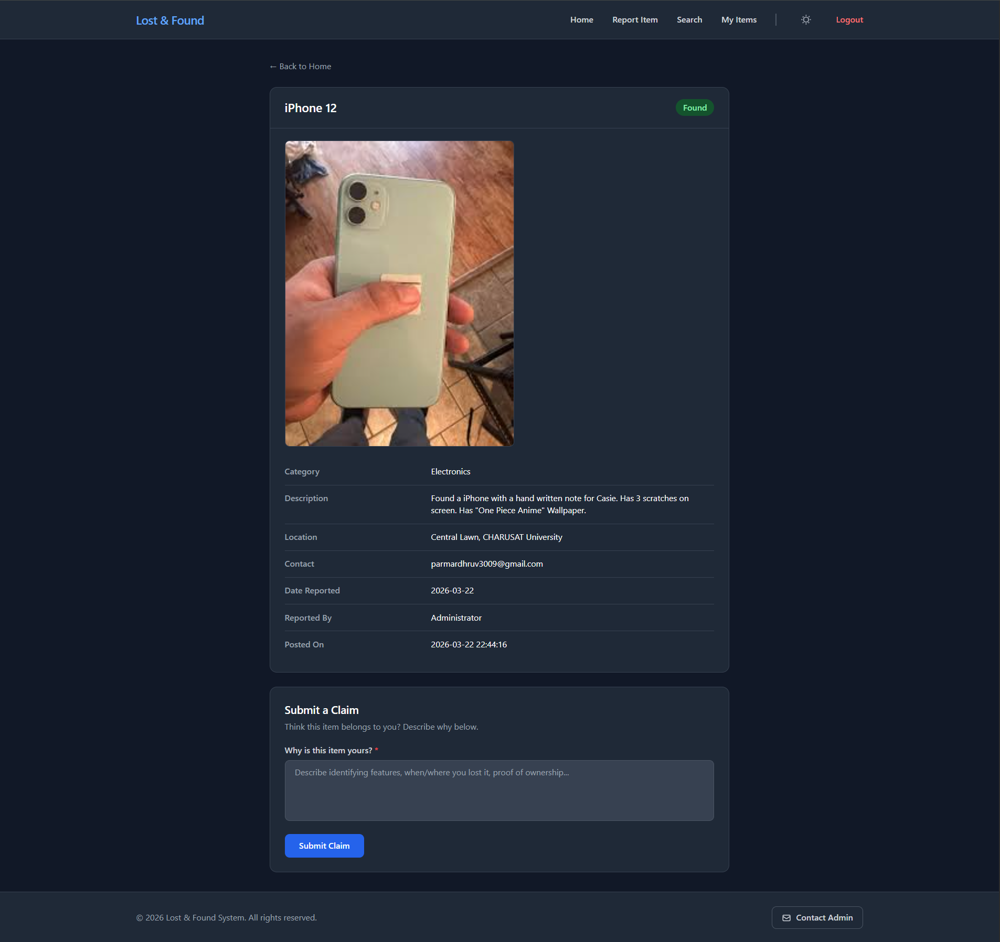
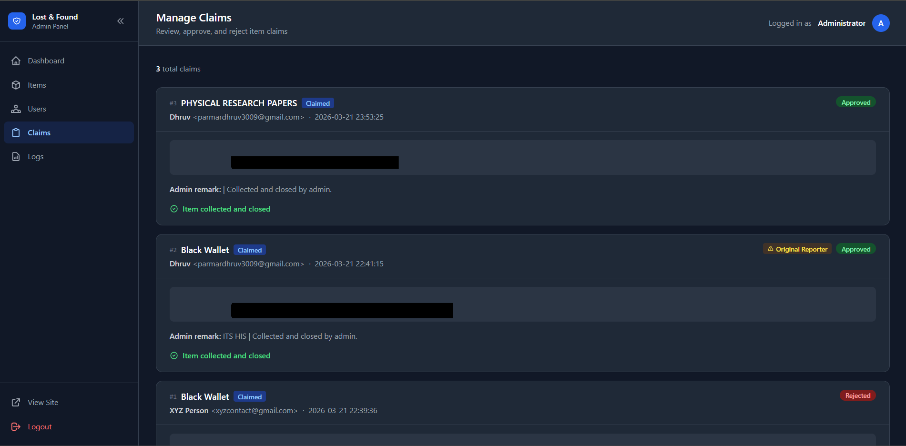
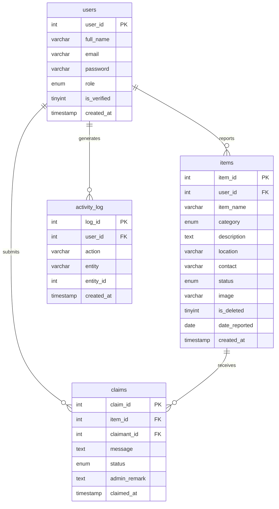

<div align="center">

# 🔍 Lost & Found Management System

### A full-stack web application to report, search, and claim lost & found items.
### Built as a university assignment — but engineered like a real product.

<br/>

[](https://php.net)
[](https://mysql.com)
[](https://tailwindcss.com)
[](https://alpinejs.dev)
[](https://flowbite.com)
[](https://getcomposer.org)
[](https://apachefriends.org)
[](LICENSE)

<br/>

> 📚 **Course:** Fundamentals of Database Management System
> 🏛️ **University:** Charotar University of Science and Technology (CHARUSAT)

</div>

---

## 📸 Screenshots

<table>
  <tr>
    <td align="center"><strong>🏠 Public Homepage</strong></td>
    <td align="center"><strong>🛡️ Admin Dashboard</strong></td>
  </tr>
  <tr>
    <td></td>
    <td></td>
  </tr>
  <tr>
    <td align="center"><strong>📋 Item Detail & Claim</strong></td>
    <td align="center"><strong>✅ Admin Claims Management</strong></td>
  </tr>
  <tr>
    <td></td>
    <td></td>
  </tr>
</table>

---

## 📖 Table of Contents

- [Overview](#-overview)
- [Features](#-features)
- [Tech Stack](#-tech-stack)
- [Database Schema](#-database-schema)
- [Folder Structure](#-folder-structure)
- [Setup Instructions](#-setup-instructions)
- [Default Admin Credentials](#-default-admin-credentials)
- [Security Practices](#-security-practices)
- [Edge Cases Handled](#-edge-cases-handled)
- [Known Limitations](#-known-limitations)
- [About the Developer](#-about-the-developer)
- [Support](#-support)

---

## 🧭 Overview

This system lets users **report** lost or found items, **search** through reports with filters, and **submit claims** on found items. Admins manage the full lifecycle — approving or rejecting claims, moderating content, monitoring user activity, and exporting reports to PDF.

Built incrementally across **16 versions** with a clean Git history, this project demonstrates real-world backend engineering: PDO, prepared statements, bcrypt hashing, CSRF protection, soft deletes, ownership checks, email notifications, auto-expiry, and more.

---

## ✨ Features

### 🌐 Public — No Login Required
- View all reported items with live stats (Total, Lost, Found, Claimed)
- Search and filter by keyword, category, status, and date range
- View individual item detail pages with full information

### 👤 Authenticated Users
- Report a lost or found item with image upload
- View and manage their own reported items
- Edit or soft-delete their own items
- Submit a claim on a found item with a message
- Track the status of submitted claims in real time

### 🛡️ Admin Panel
- Dashboard with 9 system-wide statistics cards
- Manage all items — view, edit, soft-delete, restore
- Manage all users — view, activate, deactivate
- Manage all claims — approve or reject with remarks
- Detect duplicate item reports automatically
- Export items table to PDF
- View paginated, filterable activity log

### ⚙️ System-Level
- **Auto-expire** — lost items older than 30 days set to `expired` automatically
- **Auto-matching** — new reports checked against existing opposite-status items for possible matches
- **Email notifications** — via PHPMailer on claim submission, approval, and rejection
- **Full activity log** — every significant action recorded with user, entity, and timestamp
- **Dark mode** — toggle persisted in `localStorage`
- **Fully responsive** — mobile, tablet, and desktop

---

## 🛠 Tech Stack

| Layer | Technology | Purpose |
|---|---|---|
| Frontend | Tailwind CSS 3.x | Utility-first styling |
| Frontend | Flowbite 2.3.0 | Component library on top of Tailwind |
| Frontend | Alpine.js 3.x | Lightweight reactivity (dark mode, sidebar) |
| Backend | PHP 8.x | Server-side logic |
| Database | MySQL 8.0 | Relational data storage |
| ORM/Query | PDO | Secure database access — no mysqli |
| Email | PHPMailer | SMTP email notifications |
| PDF | TCPDF | Server-side PDF generation |
| Server | XAMPP (Apache) | Local development environment |
| Version Control | Git + GitHub | Source control |

---

## 🗄️ Database Schema

Four tables. Clean relationships. No redundancy.



### Status Flows

**Item status:**
```
lost ──► found ──► claimed ──► (collected & closed)
  └──────────────► expired  (auto after 30 days)
```

**Claim status:**
```
pending ──► approved ──► collected & closed
        └──► rejected
```

---

## 📁 Folder Structure

```
lost-and-found/
│
├── config/
│   ├── db.php                  ← PDO connection via getDB()
│   └── init.php                ← Session start, .env loader, BASE_URL
│
├── includes/
│   ├── header.php              ← HTML head, CDN links, dark mode init
│   ├── navbar.php              ← Responsive navbar with dark mode toggle
│   └── footer.php              ← Footer with Contact Admin (mailto)
│
├── auth/
│   ├── login.php               ← Login form + handler
│   ├── register.php            ← Registration form + handler
│   └── logout.php              ← Session destroy + redirect
│
├── pages/
│   ├── home.php                ← Homepage: stats + all items table
│   ├── report.php              ← Report lost/found item form
│   ├── search.php              ← Advanced search with filters + sort
│   ├── item_detail.php         ← Single item view + claim form
│   └── my_items.php            ← User's own reported items
│
├── actions/
│   ├── insert_item.php         ← POST handler: report item
│   ├── update_item.php         ← POST handler: edit item
│   ├── delete_item.php         ← POST handler: soft delete
│   ├── submit_claim.php        ← POST handler: submit claim
│   └── handle_claim.php        ← POST handler: approve/reject claim
│
├── admin/
│   ├── index.php               ← Admin dashboard
│   ├── items.php               ← Manage all items
│   ├── users.php               ← Manage all users
│   ├── claims.php              ← Manage all claims
│   ├── logs.php                ← Activity log viewer
│   ├── auth_check.php          ← Admin middleware
│   ├── sidebar.php             ← Collapsible sidebar (Alpine.js)
│   └── footer.php              ← Admin footer
│
├── database/
│   └── schema.sql              ← Full schema + seeded admin account
│
├── assets/
│   ├── css/style.css
│   ├── js/main.js
│   └── uploads/                ← User-uploaded images (gitignored)
│       └── .gitkeep
│
├── docs/
│   └── screenshots/            ← README screenshots
│
├── .env                        ← DB credentials — never on GitHub
├── .gitignore
├── composer.json
└── index.php                   ← Entry point → redirects to home.php
```

---

## 🚀 Setup Instructions

### Prerequisites
- [XAMPP](https://apachefriends.org) installed and running (Apache + MySQL)
- [Composer](https://getcomposer.org) installed
- [Git](https://git-scm.com) installed

### Step 1 — Clone the repository

```bash
git clone https://github.com/Parmar-Dhruv/Lost-and-Found-System.git
```

### Step 2 — Place in XAMPP web root

Move the cloned folder to:
```
C:\xampp\htdocs\lost-and-found\
```

### Step 3 — Install Composer dependencies

```bash
cd C:\xampp\htdocs\lost-and-found
composer install
```

This installs PHPMailer and TCPDF.

### Step 4 — Create the `.env` file

Create a file named `.env` in the project root:

```env
DB_HOST=localhost
DB_USER=root
DB_PASS=
DB_NAME=lost_found_db
```

> Leave `DB_PASS` empty — that is the XAMPP default.

### Step 5 — Import the database

1. Open [phpMyAdmin](http://localhost/phpmyadmin)
2. Create a new database named `lost_found_db`
3. Click **Import** and select `database/schema.sql`
4. Click **Go**

This creates all 4 tables and seeds the admin account automatically.

### Step 6 — Open the application

```
http://localhost/lost-and-found/
```

---

## 🔐 Default Admin Credentials

| Field | Value |
|---|---|
| Email | `admin@lostandfound.com` |
| Password | `Admin@1234` |

> ⚠️ Change this password immediately if deploying to a live server.

---

## 🛡️ Security Practices

| Practice | Implementation |
|---|---|
| **Prepared statements** | Every query uses `->prepare()` + `->execute()`. Zero raw queries with user input. |
| **bcrypt hashing** | `password_hash(PASSWORD_BCRYPT)` on register. `password_verify()` on login. Never plain text. |
| **CSRF protection** | Every form has a CSRF token. Backend validates it before any action. |
| **Backend validation** | All input validated server-side. Frontend validation is never trusted alone. |
| **Soft delete only** | `is_deleted = 1` — nothing is ever permanently deleted. Admin can restore anything. |
| **Ownership checks** | Users can only edit/delete their own items. Verified on the backend, not just hidden in UI. |
| **Randomized filenames** | Uploaded images renamed to random strings. Original filenames discarded. |
| **File validation** | Only jpg, jpeg, png, gif accepted. Maximum 2MB enforced on backend. |
| **`.env` credentials** | DB credentials never hardcoded. `.env` is in `.gitignore` — never on GitHub. |
| **`.htaccess` protection** | Sensitive folders blocked from direct browser access. |

---

## 🧩 Edge Cases Handled

All 15 edge cases implemented. None skipped.

| # | Edge Case | How It's Handled |
|---|---|---|
| EC-01 | Anyone edits another user's item | Ownership check in `update_item.php` — session `user_id` must match item's `user_id` |
| EC-02 | Anyone deletes another user's item | Same ownership check + soft delete in `delete_item.php` |
| EC-03 | Fake contact information | `is_verified` flag required before a user can report any item |
| EC-04 | Same item reported twice | Admin duplicate detection flags items with similar name + location + date |
| EC-05 | Multiple people claim same item | All claims stored as pending. Admin approves one — rest auto-rejected with system remark |
| EC-06 | Item owner claims their own item | Allowed — system flags claimant as original reporter. Admin verifies manually |
| EC-07 | Claim approved but never collected | Two-step flow: Approved → Pending Collection → Admin confirms collected → Closed |
| EC-08 | Finder keeps item after rejection | Outside software scope — admin remarks visible to claimant. Documented limitation |
| EC-09 | Future date reported | Backend rejects any `date_reported` value greater than today |
| EC-10 | Empty or junk description | Backend enforces minimum 20-character description length |
| EC-11 | Duplicate user accounts | `UNIQUE` constraint on `email` — same email blocked at DB level |
| EC-12 | Item never resolved | Auto-expire: `status='lost'` items older than 30 days set to `status='expired'` on every page load |
| EC-13 | No admin exists | Admin account seeded in `schema.sql` — always present from first import |
| EC-14 | Admin deletes wrong item | Soft delete only — admin can restore any item from the admin panel |
| EC-15 | Admin account compromised | bcrypt hashing — even with direct DB access, the plain-text password is unrecoverable |

---

## ⚠️ Known Limitations

- **Fake phone numbers** — email uniqueness is enforced at registration, but phone number authenticity cannot be verified programmatically.
- **Physical enforcement** — if a finder keeps an item after a claim is rejected, the system cannot enforce its return. This is a real-world limitation outside the software's scope.
- **Multiple accounts** — a person can register twice with two different email addresses. Identity verification beyond email is not implemented.
- **Email delivery** — PHPMailer is configured for local development. A live SMTP service (Gmail, Mailgun, etc.) must be configured before deploying to production.

---

## 👨‍💻 About the Developer

<div align="center">


### Dhruv Parmar

Student · Charotar University of Science and Technology (CHARUSAT) · 2026

[](https://github.com/Parmar-Dhruv)

</div>

---

## ☕ Support

If this project helped you, saved you time, or you just want to say thanks — a small contribution means a lot.

<div align="center">
  
**UPI ID:** `dhruvparmar8714-1@okhdfcbank`

</div>

---

<div align="center">

Made with 💙 by **Dhruv Parmar** · CHARUSAT · 2026

⭐ If you found this useful, consider starring the repository.

</div>
